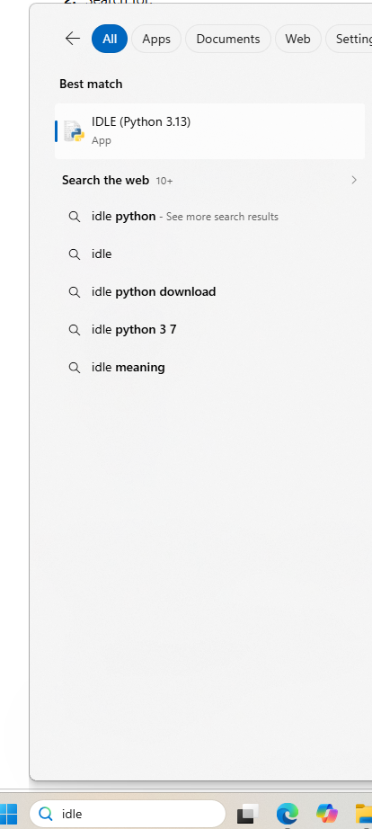
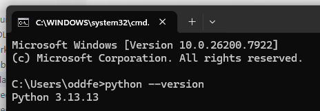
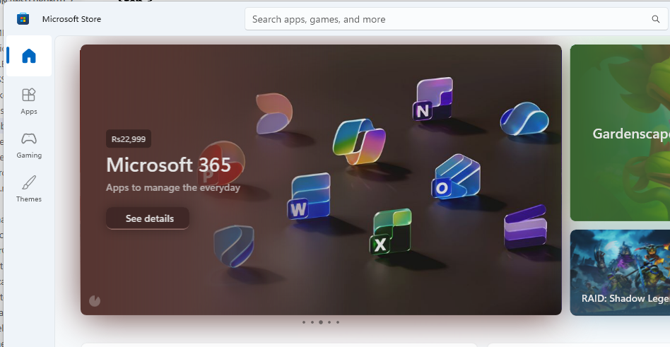
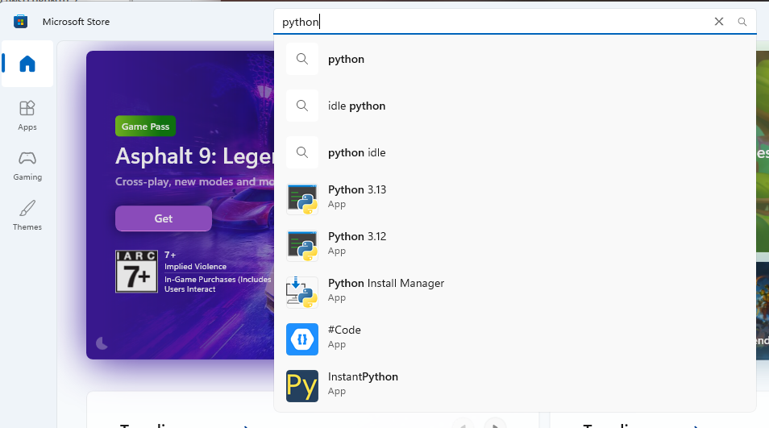
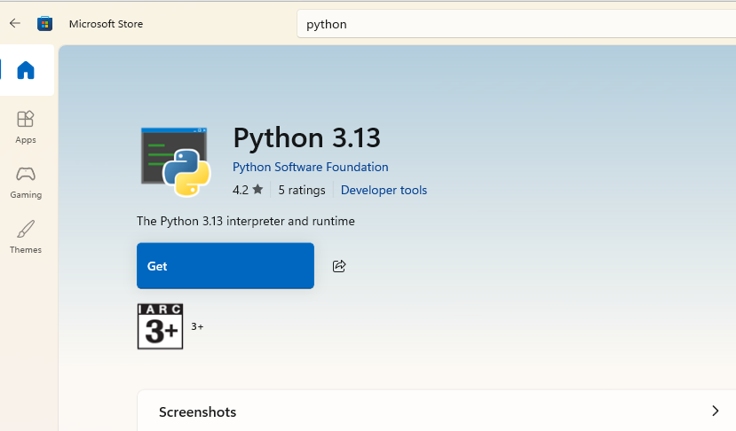
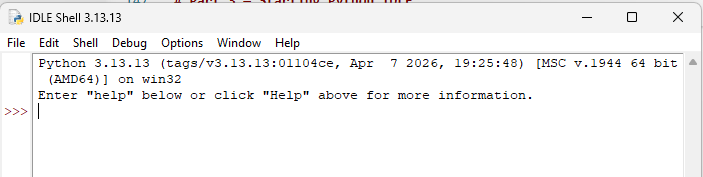
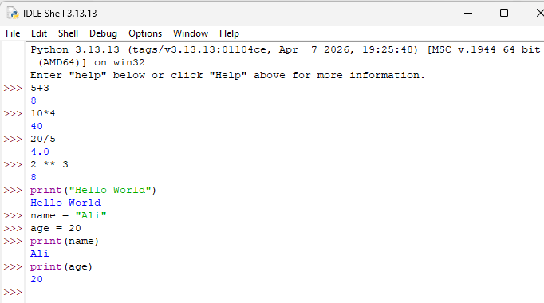
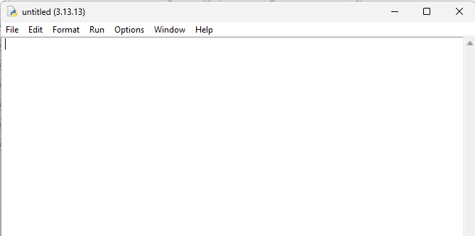
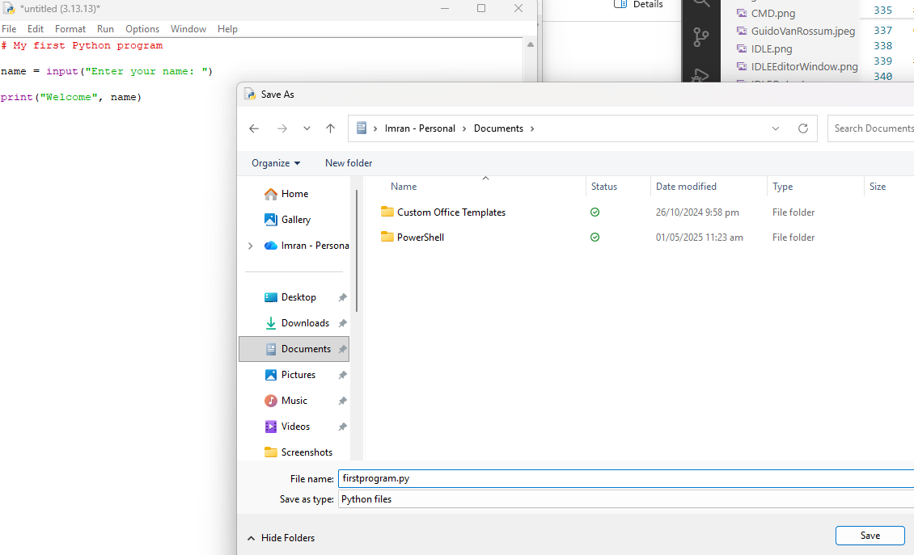
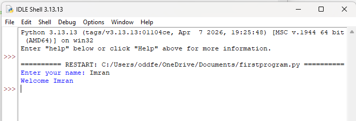

# Department of Computer Science & Information Technology  
# Programming Fundamentals Lab

# Lab 1 — Getting Started with Python IDLE on Microsoft Windows

---

# Objectives

By the end of this lab, students will be able to:

- Check whether Python and IDLE are installed on Windows
- Install Python using Microsoft Store
- Open Python IDLE
- Use Python Interactive Mode (`>>>`)
- Execute simple Python commands
- Create and save Python files (`.py`)
- Run Python programs using IDLE

---

# Introduction

Python is a high-level programming language widely used in software development, data science, artificial intelligence, automation, and web development.

Python comes with an integrated development environment called **IDLE** (Integrated Development and Learning Environment), which is beginner-friendly and suitable for learning programming fundamentals.

---

# Part 1 — Checking Whether Python is Installed

## Method 1 — Using the Start Menu

### Step 1

Click the **Start** button on Windows.

### Step 2

Type:

```text
IDLE
```

If Python is installed, you should see something similar to:

```text
IDLE (Python 3.x 64-bit)
```

---



---

## Method 2 — Using Command Prompt

### Step 1

Press:

```text
Windows + R
```

### Step 2

Type:

```text
cmd
```

and press **Enter**.

### Step 3

In Command Prompt, type:

```bash
python --version
```

Example output:

```text
Python 3.13.2
```

If Python is not installed, you may see:

```text
Python was not found
```

---



---

# Part 2 — Installing Python Using Microsoft Store

## Step 1 — Open Microsoft Store

1. Click the **Start** button
2. Search for: Microsoft Store
3. Open the application

---


---

## Step 2 — Search for Python

In the search bar, type: `Python`

Select the latest stable version provided by: `Python Software Foundation `
Example: `Python 3.13`

---




---

## Step 3 — Install Python

Click the **Get** button and wait for installation to complete.

The installation includes:

- Python Interpreter
- IDLE Editor
- Python Standard Libraries

---



---

# Part 3 — Starting Python IDLE

## Step 1

Open the Start Menu.

## Step 2

Search for: `IDLE `

## Step 3

Open: `IDLE (Python 3.x 64-bit)`

A window called the **Python Shell** will appear.

---




---

# Part 4 — Understanding Interactive Mode

The symbol:

```python
>>>
```

is called the **Python Prompt**.

This mode is called:

- Interactive Mode
- Python Shell
- REPL (Read-Evaluate-Print-Loop)

Commands typed after `>>>` are executed immediately.

---

# Part 5 — Executing Commands in Interactive Mode

## Example 1 — Arithmetic Operations

Type the following commands:

```python
>>> 5 + 3
>>> 10 * 4
>>> 20 / 5
>>> 2 ** 3
```

Expected output:

```python
8
40
4.0
8
```

---

## Example 2 — Displaying Text

```python
>>> print("Hello World")
```

Output:

```text
Hello World
```

---

## Example 3 — Using Variables

```python
>>> name = "Ali"
>>> age = 20
>>> print(name)
>>> print(age)
```

---



---

# Part 6 — Creating a Python Program File

Interactive mode is useful for quick testing, but complete programs are usually written in files.

Python program files use the extension:

```text
.py
```

Example:

```text
program.py
```

---

## Step 1 — Open a New File

In IDLE:

1. Click:

```text
File → New File
```

A new editor window will appear.

---




---

# Part 7 — Writing a Simple Python Program

Type the following program in the editor window:

```python
# My first Python program

name = input("Enter your name: ")

print("Welcome", name)
```

---

### Explanation of the Program

## Line 1

```python
# My first Python program
```

This is a comment.

Comments are ignored by Python and are used for explanation.

---

## Line 2

```python
name = input("Enter your name: ")
```

- `input()` receives input from the user
- The entered value is stored in variable `name`

---

## Line 3

```python
print("Welcome", name)
```

- `print()` displays output on the screen

---

# Part 8 — Saving the Program

## Step 1

Click: `File → Save`

## Step 2

Choose a folder such as: `Documents`

## Step 3

Enter file name: `first_program.py`

## Step 4

Click **Save**

---




---

# Part 9 — Running the Python Program

After saving the file:

1. Click: `Run → Run Module`

OR press: `F5`

The Python Shell window will execute the program.

Example:

```text
Enter your name: Imran
Welcome Imran
```

---




---

# Common Mistakes

## 1. Forgetting to Save the File

Always save the file before pressing `F5`.

---

## 2. Wrong File Extension

Correct: `program.py`

Incorrect: `program.txt`

---

## 3. Typing Errors

Python is case-sensitive.

Incorrect:

```python
Print("Hello")
```

Correct:

```python
print("Hello")
```

---

# Practice Exercises

## Exercise 1 — Arithmetic Practice

Use Interactive Mode to calculate:

```python
25 + 75
100 / 4
9 ** 2
```

---

## Exercise 2 — Student Information Program

Create a file named:

```text
student.py
```

Write a program that:

- Takes student name as input
- Takes department name as input
- Displays both values

---

## Exercise 3 — Welcome Message

Write and run a program that prints:

```text
Welcome to Python Programming
```

---

# Lab Tasks

| Task | Completed |
|---|---|
| Located Python IDLE |  |
| Installed Python |  |
| Opened Interactive Mode |  |
| Executed Commands in Shell |  |
| Created a `.py` File |  |
| Saved Python Program |  |
| Executed Program using F5 |  |

---

# Viva Questions

1. What is Python IDLE?
2. What is Interactive Mode?
3. What does `>>>` represent?
4. What is the extension of Python files?
5. What is the purpose of `print()`?
6. What is the purpose of `input()`?
7. What is a variable in Python?
8. What is the shortcut key for running a Python program in IDLE?

---

# Lab Summary

In this lab, students learned how to:

- Check whether Python is installed
- Install Python using Microsoft Store
- Open and use Python IDLE
- Execute commands in Interactive Mode
- Create and save Python files
- Run Python programs using IDLE

Python IDLE provides a simple and beginner-friendly environment for learning programming fundamentals.

---